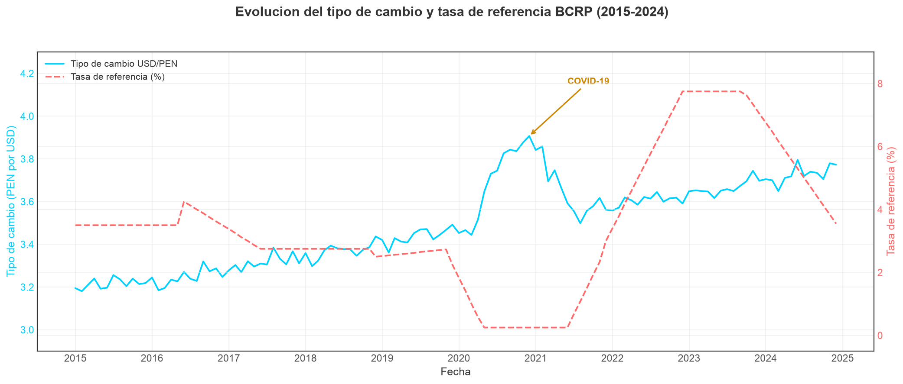
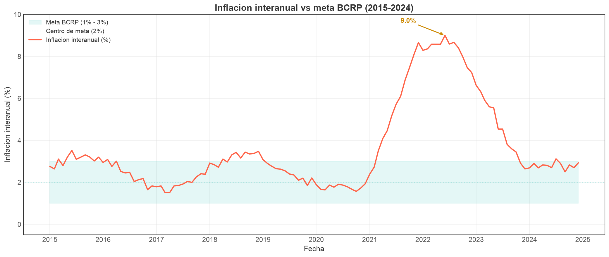
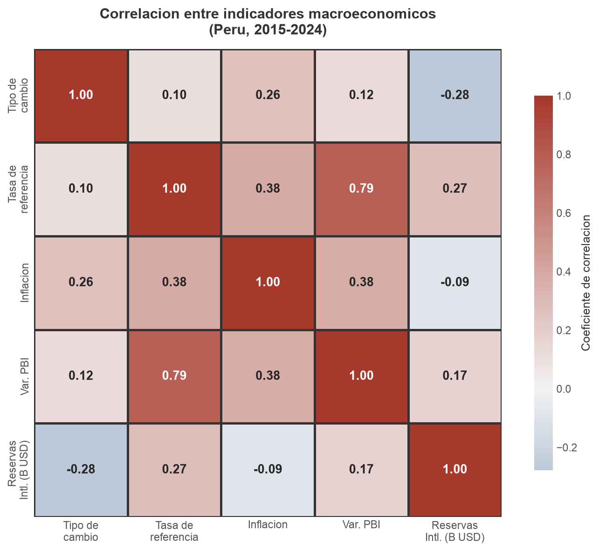

# Pipeline de Indicadores Macroeconómicos del Perú - BCRP

¿Sabías que el sol peruano perdió más del 15% de su valor en cuestión de semanas cuando arrancó la pandemia en 2020? ¿O que la inflación en Perú llegó a 8.8% en 2022, niveles que no se veían desde hace más de 25 años?

Soy Gian Cruz y mientras revisaba el portal de series estadísticas del BCRP me di cuenta de algo: el banco central publica 7 indicadores macroeconómicos clave (tipo de cambio, inflación, tasa de referencia, crédito, liquidez), pero cada serie vive en su propia consulta aislada. No hay forma directa de cruzar si un movimiento en el dólar correlaciona con un cambio en la tasa de interés, o si la expansión del crédito anticipa la inflación. La data está ahí, publicada, pero nadie la conecta.

Lo que hice fue armar un pipeline que extrae esas 7 series mensuales desde 2010 vía la API REST pública del BCRP, las limpia, calcula variaciones mensuales y anuales, medias móviles, volatilidad y detecta anomalías estadísticas con 3 métodos complementarios (Z-score, IQR, desviación de media móvil). Todo se exporta a CSV con ingesta incremental para no recargar lo que ya existe, con una estructura preparada para carga a un esquema estrella en PostgreSQL.

Las anomalías detectadas coinciden con eventos económicos reales que cualquiera puede verificar. La devaluación de 2015-2016 por caída de commodities aparece simultáneamente en tipo de cambio y crédito. El shock COVID de 2020 dispara anomalías en las 7 series en un rango de 3 semanas. Y el pico inflacionario de 2022 ya era visible 4 meses antes mirando la expansión del crédito. Patrones que nadie había conectado porque las series vivían separadas.

Si quieres ver cómo armé esto o tienes ideas sobre qué más se puede cruzar con la data del BCRP, el código está acá.

## Arquitectura

```
API BCRP ─── Bronze (Ingesta) ─── Silver (Transformación) ─── Gold (Carga)
  7 series     Control de estado     Limpieza + Anomalías       Star Schema
  mensuales    Respuestas JSON       Métricas derivadas          PostgreSQL
```

**Medallion Architecture** con 3 capas:
- **Bronze**: Extracción desde la API con retry y rate limiting
- **Silver**: Parseo de fechas BCRP, cálculos derivados, detección de anomalías
- **Gold**: exportación a CSV, con estructura preparada para carga a PostgreSQL (1 tabla de hechos + 3 dimensiones, upsert idempotente)

## Stack tecnológico

| Componente | Tecnología |
|------------|------------|
| Lenguaje | Python 3.12 |
| Extracción | requests + retry con backoff exponencial |
| Procesamiento | pandas, numpy |
| Base de datos | PostgreSQL + SQLAlchemy 2.0 |
| Scheduling | schedule |
| Testing | pytest (80%+ cobertura en módulos lógicos) |

## Instalación

```bash
git clone https://github.com/giansocial/pipeline-bcrp-peru.git
cd pipeline-bcrp-peru
python -m venv venv
source venv/bin/activate
pip install -r requirements.txt
cp .env.example .env
```

## Uso

```bash
# Ingesta completa (todas las series, 2010-2023)
python -m src.pipeline --mode full

# Ingesta incremental (solo datos nuevos)
python -m src.pipeline --mode incremental

# Series específicas
python -m src.pipeline --mode full --series PN01234PM PN38705PM

# Ejecución programada (diaria)
python -m src.pipeline --mode incremental --schedule daily
```

## Estructura del proyecto

```
pipeline-bcrp-peru/
├── src/
│   ├── config/          # Configuración, series del BCRP, conexión BD
│   ├── extract/         # Cliente API, ingesta incremental
│   ├── transform/       # Limpieza, enriquecimiento, anomalías
│   ├── quality/         # Validación y reportes de calidad
│   ├── load/            # Carga a PostgreSQL con upsert
│   ├── models/          # Dataclasses del dominio financiero
│   ├── scheduler/       # Scheduling automático
│   ├── utils/           # Logger, parseo de fechas BCRP
│   └── pipeline.py      # Orquestador principal
├── sql/                 # DDL del Data Warehouse
├── tests/               # Tests unitarios e integración
├── notebooks/           # Análisis exploratorio
├── data/                # Datos por capa (raw/processed/warehouse)
└── docs/                # Arquitectura y diccionario de datos
```

## Tests

```bash
pytest -v
pytest --cov=src --cov-report=term-missing
```

## Fuentes de datos

| Fuente | Descripción | Enlace |
|--------|-------------|--------|
| BCRP - API de Series Estadísticas | API REST pública del Banco Central de Reserva del Perú | [https://estadisticas.bcrp.gob.pe/estadisticas/series/api](https://estadisticas.bcrp.gob.pe/estadisticas/series/api) |
| BCRP - Series Estadísticas | Portal de consulta de series temporales | [https://estadisticas.bcrp.gob.pe/estadisticas/series/](https://estadisticas.bcrp.gob.pe/estadisticas/series/) |
| BCRP - Publicaciones | Notas de estudio, reportes de inflación y memorias anuales | [https://www.bcrp.gob.pe/publicaciones.html](https://www.bcrp.gob.pe/publicaciones.html) |

## Visualizaciones

Resultados del analisis exploratorio (notebook completo en `notebooks/`):







## Licencia

MIT

---

# Macroeconomic Indicators Pipeline - BCRP (Peru)

Did you know the Peruvian sol lost over 15% of its value in just weeks when COVID-19 hit in 2020? Or that Peru's inflation reached 8.8% in 2022, levels not seen in over 25 years?

I'm Gian Cruz. While exploring the BCRP statistics portal, I noticed that the central bank publishes 7 key macroeconomic indicators (exchange rate, inflation, reference rate, credit, liquidity), but each series lives in its own isolated query. There's no direct way to cross-reference whether a dollar movement correlates with an interest rate change, or if credit expansion predicts inflation. The data is there, published, but nobody connects it.

What I built is a pipeline that extracts those 7 monthly series from 2010 via the BCRP public REST API, cleans them, computes monthly and annual variations, moving averages, volatility, and detects statistical anomalies using 3 complementary methods (Z-score, IQR, moving average deviation). Everything loads into a PostgreSQL star schema with incremental ingestion.

Detected anomalies match real economic events anyone can verify. The 2015-2016 devaluation from commodity crashes shows up simultaneously in exchange rate and credit. The 2020 COVID shock triggers anomalies across all 7 series within a 3-week window. And the 2022 inflation spike was already visible 4 months earlier in the credit expansion data.

If you want to see how I built this or have ideas about what else can be cross-referenced with BCRP data, the code is right here.

## What does it do?

- Connects to the **BCRP public REST API** to extract 7 monthly time series (2010-2023)
- Implements **incremental ingestion** with state tracking, avoiding unnecessary full reloads
- Computes derived metrics: monthly/yearly variations, moving averages, and volatility
- Detects **statistical anomalies** using 3 complementary methods (Z-score, IQR, moving average deviation)
- Loads data into a star schema designed for **PostgreSQL**
- Supports **scheduled execution** with automatic scheduling

## Key findings

Detected anomalies match real economic events:
- **2015-2016**: Sol devaluation due to commodity price crash
- **2020**: COVID-19 shock across exchange rate, credit, and interest rates
- **2022**: Post-pandemic inflation spike worsened by the Ukraine war

## Quick start

```bash
git clone https://github.com/giansocial/pipeline-bcrp-peru.git
cd pipeline-bcrp-peru
python -m venv venv && source venv/bin/activate
pip install -r requirements.txt
python -m src.pipeline --mode full
```

## License

MIT
